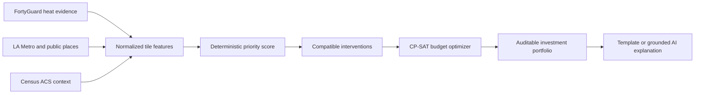

<p align="center">
  
</p>

<h1 align="center">COOLSPOT AI</h1>

<p align="center">
  <strong>From urban heat evidence to a defensible cooling-investment plan.</strong>
</p>

<p align="center">
  A map-first decision-support application for prioritizing shade structures, tree canopy,
  and cool pavement under a fixed municipal budget.
</p>

## Overview

Cities can already see that heat is uneven. The harder operational question is: **where should
limited cooling funds go first, and why?**

COOLSPOT AI combines cached FortyGuard heat intelligence with authoritative public data for
Pacoima, Los Angeles. It scores candidate locations transparently, builds a budget-feasible
portfolio with a deterministic optimizer, and presents the evidence, sources, assumptions, and
limitations behind every recommendation.

The core decision path does not depend on an LLM. AI is used only to explain an already-computed
result from structured evidence.

## What the application does

- Maps **heat**, **heat persistence**, **human exposure**, and **vulnerability** across the pilot area.
- Generates evidence-backed candidates for shade structures, tree canopy, and cool pavement.
- Ranks candidates with a published, deterministic scoring model.
- Optimizes a portfolio for `$250k`, `$500k`, `$1M`, or a custom budget using OR-Tools CP-SAT.
- Re-optimizes instantly from cached features, with **zero FortyGuard calls on budget changes**.
- Shows local planning allowances, price anchors, evidence confidence, sources, and field-check limitations.
- Provides cached FortyGuard street-view segmentation for the 20 sites in the `$1M` portfolio.
- Offers an optional, grounded AI explanation that cannot add evidence or change the ranking.

## Decision workflow



The default priority score is:

```text
0.40 × heat + 0.30 × exposure + 0.20 × vulnerability + 0.10 × cooling opportunity
```

All component scores are normalized to `[0, 1]`. Intervention feasibility and evidence confidence
are applied when estimating candidate impact. At most one intervention may be selected per site,
and total planning cost may not exceed the chosen budget.

## Evidence and data provenance

The committed demo data is real, cached, and source-attributed. Normal application reads do not
contact FortyGuard.

| Evidence | Primary source | Role in the application |
| --- | --- | --- |
| Surface heat and persistence | FortyGuard heatmap API | Heat severity and persistence layers |
| Transit locations and activity | LA Metro GTFS and April 2024 Bus Stop Patronage | Exposure context and candidate locations |
| Schools, parks, and libraries | LAUSD and City of Los Angeles open data | Public-destination context and intervention compatibility |
| Demographic and socioeconomic context | U.S. Census 2020–2024 ACS 5-year estimates | Area-level vulnerability context |
| Street segmentation | FortyGuard street-view API | Cached visual context for selected top-portfolio sites |

Retrieval dates, source URLs, publishers, and usage notes are recorded in
[`data/sources.json`](data/sources.json). The current capability snapshot is recorded in
[`data/processed/fortyguard_capabilities.json`](data/processed/fortyguard_capabilities.json).

## Truth and safety boundaries

COOLSPOT AI is a **planning-screening tool**. Its outputs are designed to support review, not replace it.

- A modeled priority or impact score is not a temperature forecast or guaranteed outcome.
- Planning costs are assumptions and published price anchors, not contractor quotes.
- Vulnerability is area-level Census context, not an assessment of any individual.
- Proximity to transit or a public destination is not treated as invented foot traffic.
- A mapped site does not establish ownership, available right-of-way, utilities, engineering feasibility,
  shade conditions, or procurement readiness.
- Recommended sites require field validation and agency review before implementation.

Claims such as “people saved,” “deaths prevented,” and unsupported exact cooling effects are
intentionally excluded.

## Architecture

| Layer | Technology | Responsibility |
| --- | --- | --- |
| Web application | Next.js 16, React 19, strict TypeScript | Map, portfolio controls, evidence review, and server-side API proxy |
| Mapping | MapLibre GL JS | Client-rendered GeoJSON layers and candidate interaction |
| API | FastAPI and Pydantic | Typed contracts, validation, cached data access, and live-refresh boundary |
| Geospatial processing | Shapely and PyProj | AOI validation, spatial joins, and deterministic preprocessing |
| Optimization | Google OR-Tools CP-SAT | Budget and mutual-exclusion constraints |
| Storage | Versioned JSON and GeoJSON artifacts | Reproducible, offline-capable MVP data |
| Explanations | Deterministic templates or OpenRouter | Explanation only, never scoring or optimization |

The browser talks only to the Next.js same-origin proxy. FortyGuard and OpenRouter secrets remain
server-side.

## Quick start

### Prerequisites

- Python `3.11+`
- Node.js `22`
- [`uv`](https://docs.astral.sh/uv/)
- npm

### 1. Configure the project

From the repository root:

```powershell
Copy-Item .env.example .env
uv sync --frozen
Set-Location web
npm ci
Set-Location ..
```

The default `.env.example` is safe for local development: `FORTYGUARD_LIVE=0` and
`EXPLANATION_MODE=template`.

### 2. Start the API

```powershell
.venv\Scripts\python.exe -m uvicorn api.app.main:app --host 127.0.0.1 --port 8000
```

- API health: <http://127.0.0.1:8000/health>
- Interactive API docs: <http://127.0.0.1:8000/docs>

### 3. Start the web application

In a second terminal:

```powershell
Set-Location web
npm run dev -- --hostname 127.0.0.1 --port 3000
```

Open <http://127.0.0.1:3000>.

## Docker

The production container serves the Next.js application and FastAPI service together in cached
demo mode:

```bash
docker build -t coolspot-ai .
docker run --rm -p 7860:7860 coolspot-ai
```

Open <http://127.0.0.1:7860>.

## Environment variables

| Variable | Default | Purpose |
| --- | --- | --- |
| `FORTYGUARD_LIVE` | `0` | Enables server-side live-refresh capability when explicitly set to `1` |
| `FORTYGUARD_API_KEY` | empty | Server-only FortyGuard credential |
| `FORTYGUARD_CREDIT_TOTAL` | `2000000` | Project credit allocation |
| `FORTYGUARD_CREDIT_RESERVE` | `500000` | Hard reserve that live work may not cross |
| `COOLSPOT_REFRESH_TOKEN` | empty | Administrator token required by the live-refresh endpoint |
| `API_BASE_URL` | `http://127.0.0.1:8000` | Server-side API origin used by Next.js |
| `EXPLANATION_MODE` | `template` | `template` or optional `llm` explanation mode |
| `OPENROUTER_API_KEY` | empty | Server-only OpenRouter credential |
| `OPENROUTER_MODEL` | `stealth/ox-alpha` | OpenRouter model used only for grounded explanations |

Never expose `FORTYGUARD_API_KEY`, `OPENROUTER_API_KEY`, or `COOLSPOT_REFRESH_TOKEN` through a
`NEXT_PUBLIC_` variable or commit them to source control.

## Data modes

### Cached demo mode

`FORTYGUARD_LIVE=0` is the default for development, CI, judging, and offline fallback. It serves
committed processed evidence and cannot submit paid FortyGuard work.

### Live refresh mode

`FORTYGUARD_LIVE=1` enables an explicit, authenticated server-side refresh. The credit governor:

1. checks current usage,
2. estimates the request cost from observed deltas,
3. rejects work that could breach the 500,000-credit reserve,
4. records activity IDs and request hashes, and
5. prevents duplicate successful requests.

Live mode is not required to use the core application.

## API surface

| Method | Endpoint | Purpose |
| --- | --- | --- |
| `GET` | `/health` | Service readiness |
| `GET` | `/v1/pilot` | Pilot boundary and metadata |
| `GET` | `/v1/layers/{layer}` | Heat, persistence, exposure, or vulnerability GeoJSON |
| `GET` | `/v1/candidates` | Compatible intervention candidates |
| `POST` | `/v1/optimize` | Deterministic budget optimization |
| `GET` | `/v1/sites/{site_id}` | Selected-site evidence |
| `GET` | `/v1/sites/{site_id}/street-view` | Cached street context when available |
| `POST` | `/v1/sites/{site_id}/explanation` | Grounded explanation of a selected result |
| `GET` | `/v1/methodology` | Weights, assumptions, sources, and limitations |
| `GET` | `/v1/data-status` | Freshness, mode, and credit status |
| `POST` | `/v1/refresh` | Authenticated, credit-governed live refresh |

`POST /v1/optimize` accepts scenario inputs only and never calls FortyGuard.

## Testing and validation

Run backend quality checks from the repository root:

```powershell
.venv\Scripts\python.exe -m ruff check api
.venv\Scripts\python.exe -m mypy api
.venv\Scripts\python.exe -m pytest
```

Run frontend checks:

```powershell
Set-Location web
npm run check
npm run build
npm run test:e2e
```

Validate the cached API demo path while the API is running:

```powershell
.venv\Scripts\python.exe scripts\validate_demo.py --base-url http://127.0.0.1:8000
```

CI and automated tests must not make live FortyGuard calls.

## Repository structure

```text
.
├── api/                  # FastAPI contracts, services, and tests
├── config/               # Versioned scoring and intervention configuration
├── data/
│   ├── fixtures/         # Sanitized external API fixtures
│   ├── processed/        # Demo-ready evidence and model inputs
│   └── sources.json      # Provenance, retrieval dates, and usage notes
├── scripts/              # Data preparation, refresh, and validation utilities
├── web/                  # Next.js application, tests, and Playwright flow
├── AGENTS.md             # Repository operating and safety rules
├── PRODUCT.md            # Product scope and acceptance criteria
├── ARCHITECTURE.md       # Technical contracts and design decisions
└── TASKS.md              # Dependency-ordered delivery checklist
```

## Project status

The hackathon MVP is implemented and validated locally. Deployment and final demo freeze remain
tracked in [`TASKS.md`](TASKS.md). The cached dataset currently includes 152 compatible candidates,
real FortyGuard TCM and persistence layers, and street segmentation for the deterministic `$1M`
portfolio.

## Documentation

- [Product definition and acceptance criteria](PRODUCT.md)
- [Architecture and system contracts](ARCHITECTURE.md)
- [Implementation evidence](EVIDENCE.md)
- [Meaningful engineering decisions and errors](BUILDLOG.md)
- [Delivery checklist](TASKS.md)

## Contributing

Read [`AGENTS.md`](AGENTS.md) before making changes. Work through [`TASKS.md`](TASKS.md) in dependency
order, keep ranking and optimization deterministic, test every change, and preserve source and
uncertainty disclosures.
